# AI Career Platform

AI Career Platform is a full-stack career intelligence application for job seekers who want a sharper resume, stronger interview preparation, and a clearer learning path. It combines resume parsing, ATS scoring, AI-powered feedback, a resume builder, learning roadmaps, task tracking, interview practice, and coding preparation in one polished dashboard.

The platform uses a hybrid intelligence approach: deterministic parsing and scoring run first for speed and consistency, then Gemini can enhance the output with semantic feedback, career recommendations, skill gaps, and interview-ready insights.

<p align="center">
  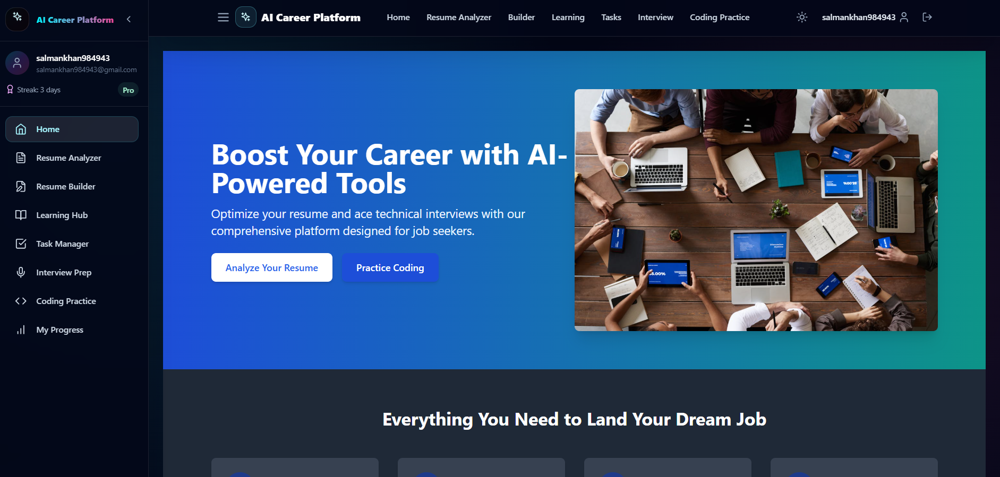
</p>

## Key Features

- Secure Supabase authentication with login, signup, email verification, and protected routes.
- Resume upload for PDF and DOCX files.
- Structured resume parsing for contact information, education, experience, projects, and skills.
- ATS score with explainable category breakdowns and improvement signals.
- AI enhancement layer for resume feedback, job fit, project ideas, interview questions, and action plans.
- Resume builder with ATS-friendly sections and live preview.
- Learning hub with role-focused resources and weekly learning plans.
- Task manager for tracking career preparation work.
- Interview preparation workspace for structured answer practice.
- Coding practice module with problems, code editor, test cases, and progress views.
- Single-service production deployment where FastAPI serves both the API and the built React app.

## Tech Stack

| Layer | Technologies |
| --- | --- |
| Frontend | React, TypeScript, Vite, Tailwind CSS, React Router, Framer Motion |
| UI and Charts | Lucide React, Chart.js, React Chart.js 2, React Ace |
| Backend | Python, FastAPI, Uvicorn, Django REST Framework legacy backend |
| Resume Intelligence | PyMuPDF, python-docx, docx2txt, pdfminer.six, spaCy, NLTK, RapidFuzz, pyresparser |
| AI and Auth | Gemini API, Supabase Auth, Supabase PostgreSQL, Supabase Storage-ready schema |
| Deployment | Docker, Render/Railway/Fly compatible, single-process FastAPI static hosting |

## Screenshots

Screenshots are stored in the [`Screenshots`](Screenshots) folder and displayed below in the intended product walkthrough order.

### 1. Login Page

<p align="center">
  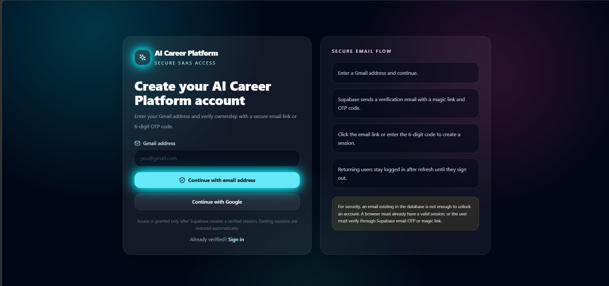
</p>

### 2. Signup Page

<p align="center">
  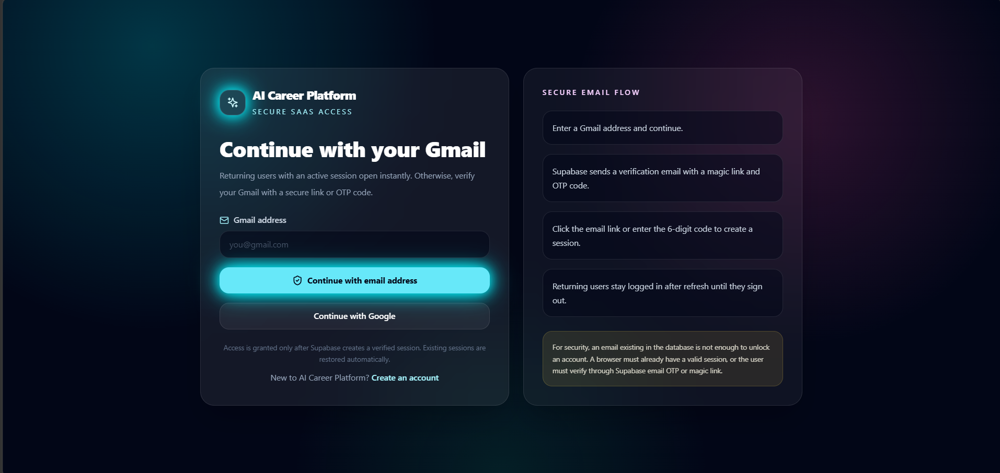
</p>

### 3. Email Verification

<p align="center">
  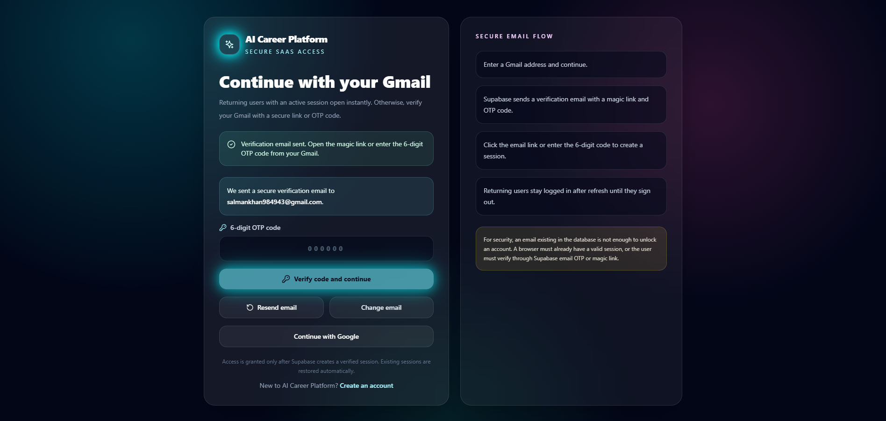
</p>

### 4. Dashboard Overview

<p align="center">
  
</p>

### 5. Dashboard Insights

<p align="center">
  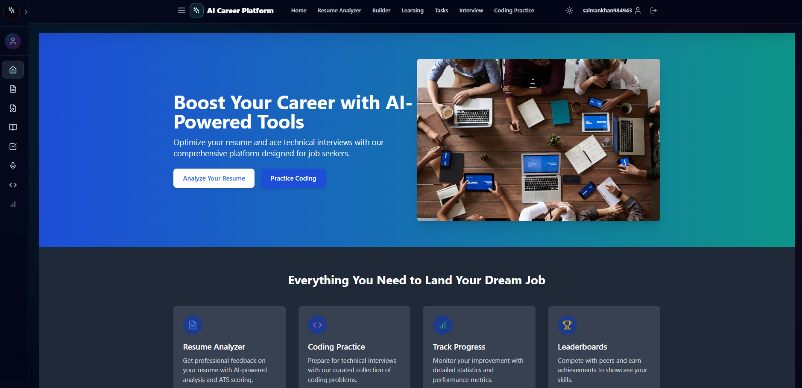
</p>

### 6. Dashboard Activity

<p align="center">
  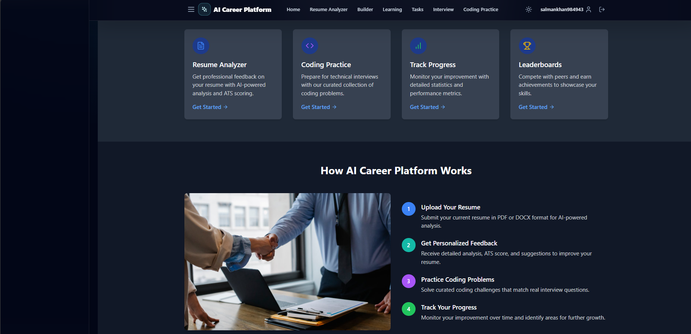
</p>

### 7. Resume Upload

<p align="center">
  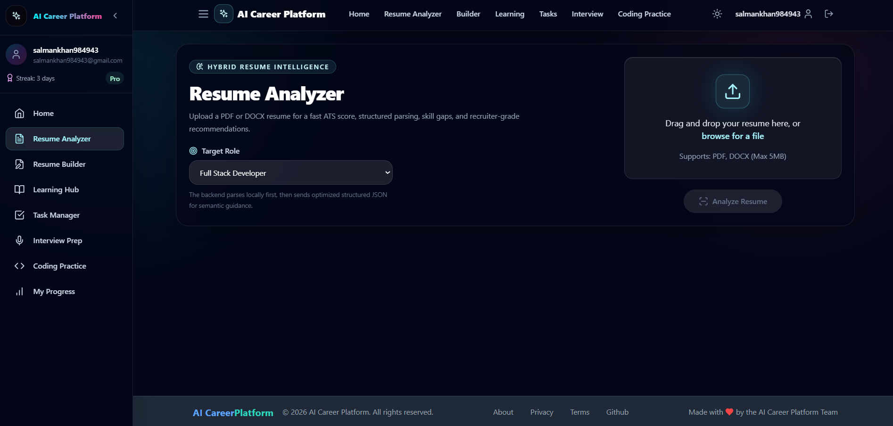
</p>

### 8. ATS Score

<p align="center">
  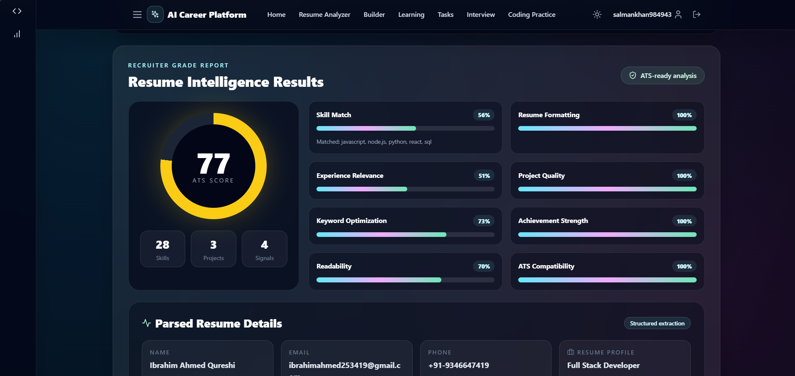
</p>

### 9. Resume Parsing Result 1

<p align="center">
  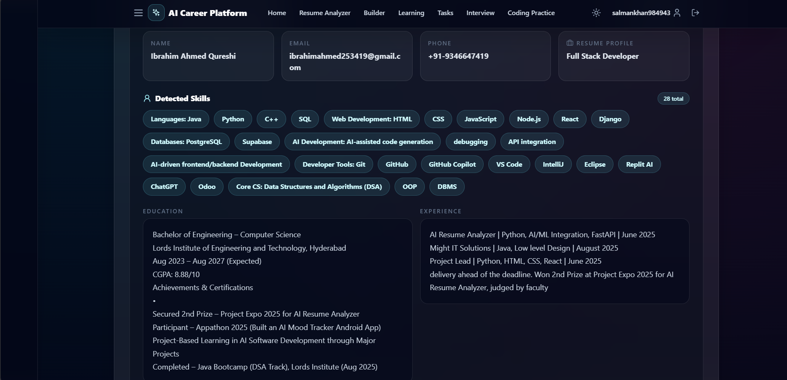
</p>

### 10. Resume Parsing Result 2

<p align="center">
  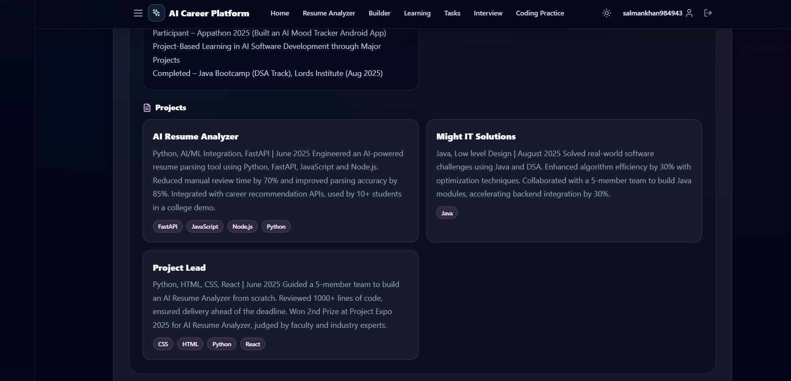
</p>

### 11. Resume Parsing Result 3

<p align="center">
  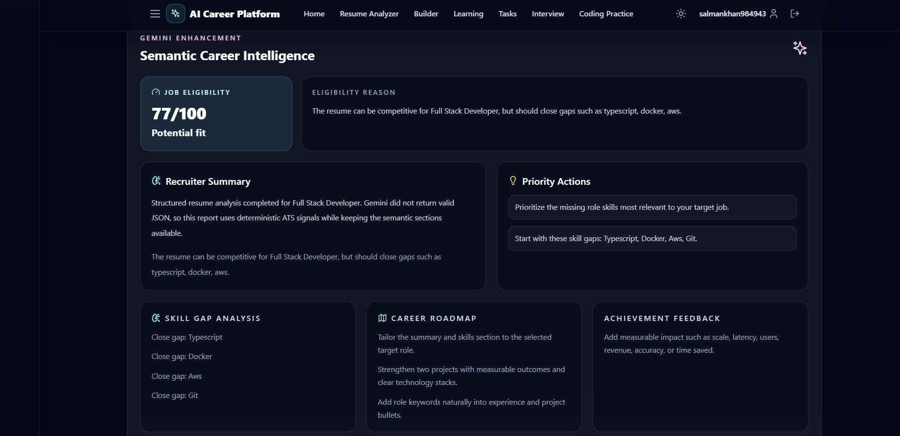
</p>

### 12. Resume Parsing Result 4

<p align="center">
  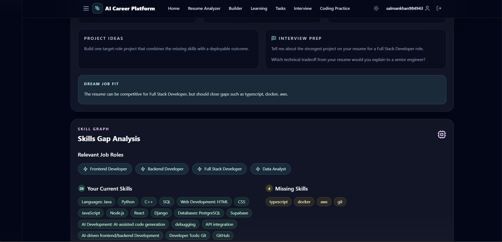
</p>

### 13. Resume Parsing Result 5

<p align="center">
  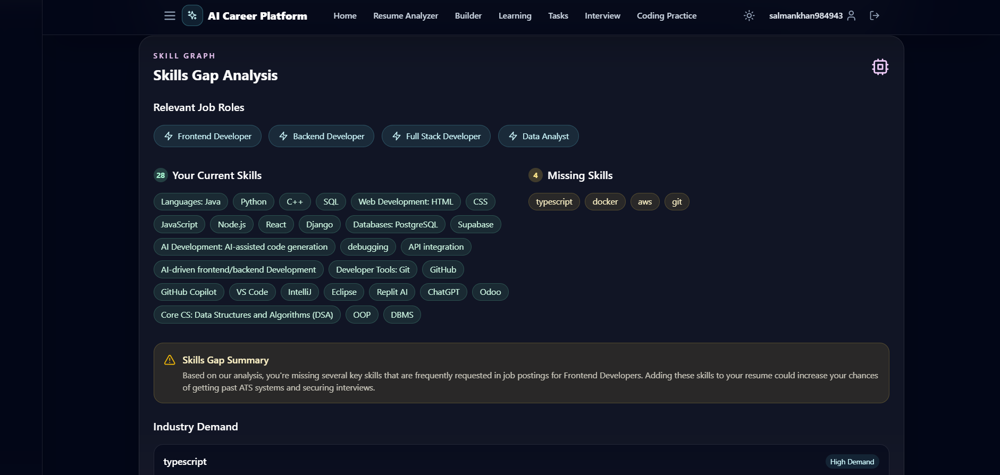
</p>

### 14. Resume Parsing Result 6

<p align="center">
  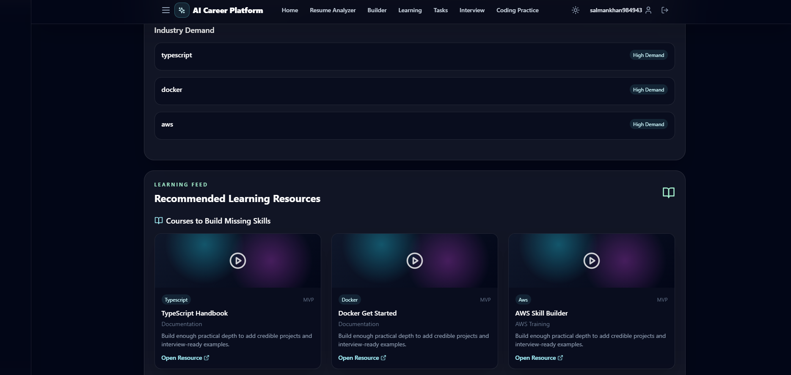
</p>

### 15. Resume Parsing Result 7

<p align="center">
  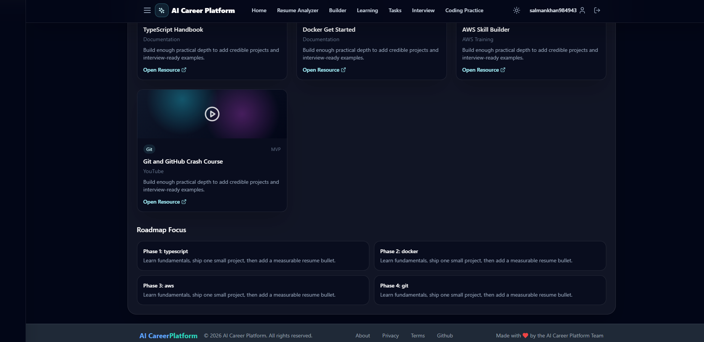
</p>

### 16. Resume Builder

<p align="center">
  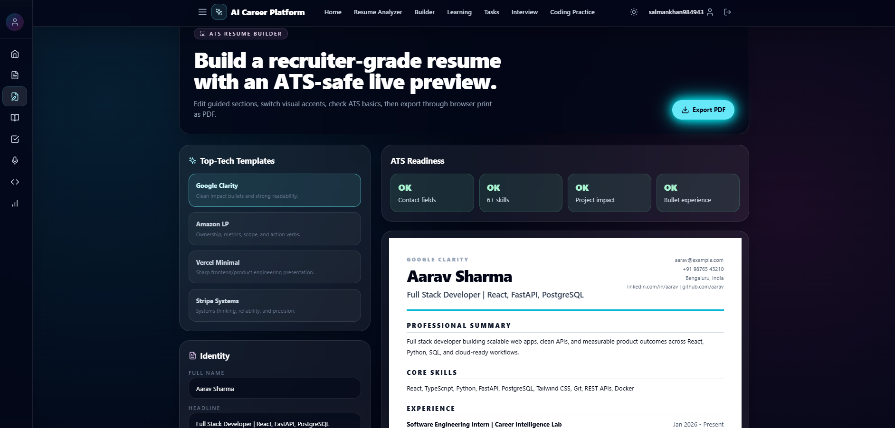
</p>

### 17. Learning Hub

<p align="center">
  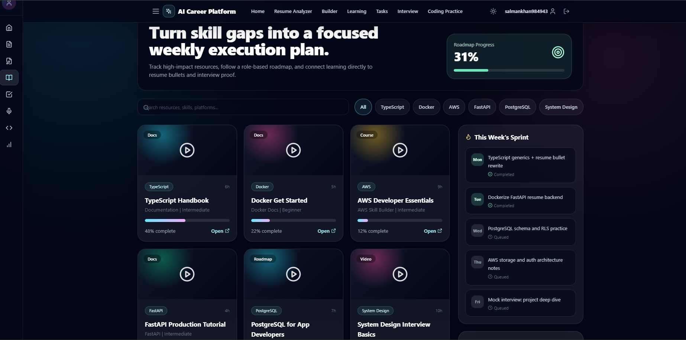
</p>

### 18. Task Manager

<p align="center">
  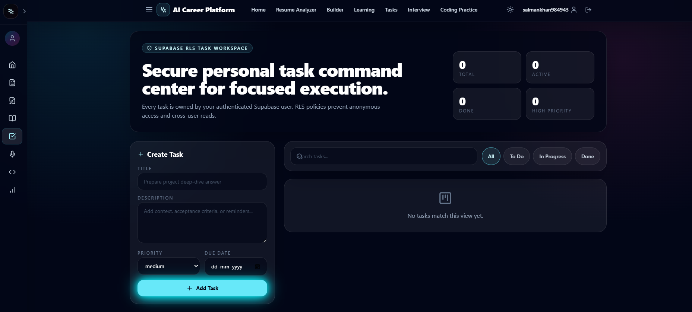
</p>

### 19. Interview Preparation

<p align="center">
  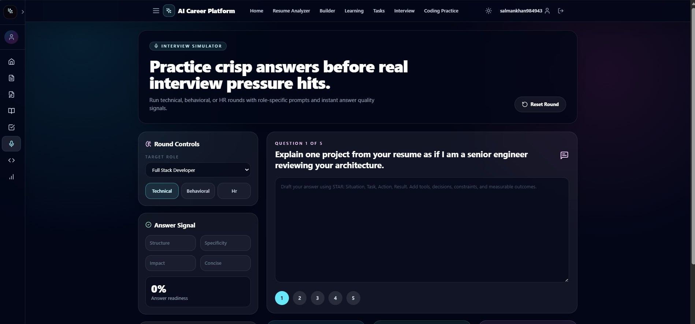
</p>

### 20. Coding Practice

<p align="center">
  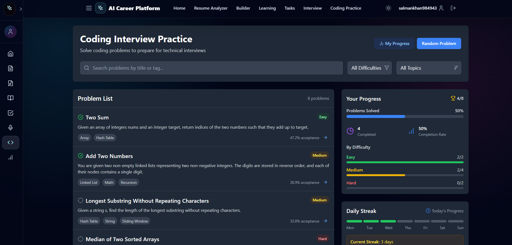
</p>

## Architecture

```text
User Browser
  |
  | React app served by FastAPI in production
  v
FastAPI
  |-- /api/health
  |-- /api/upload-resume/
  |-- Static React app from frontend/dist
  |
  |-- Supabase JWT validation
  |-- Resume text extraction
  |-- Deterministic parsing and ATS scoring
  |-- Optional Gemini enhancement
  v
Supabase Auth + PostgreSQL + Storage-ready schema
```

## Project Structure

```text
ai-career-platform/
  backend/
    django_backend/                  # Legacy Django REST backend
    project/resume_backend/
      app/resume_parser/
        main.py                      # FastAPI app and API routes
        auth.py                      # Supabase JWT and Gmail validation
        parser_main.py               # Resume parser entrypoint
        ats_engine.py                # ATS scoring and resume intelligence
        ai_enhancer.py               # Gemini enhancement layer
      requirements.txt               # Backend Python dependencies
  frontend/
    src/
      components/                    # Layout, auth, resume, coding UI
      context/                       # Auth and theme providers
      lib/                           # API, Supabase, career data helpers
      pages/                         # App pages and protected routes
  Screenshots/                       # README walkthrough images
  supabase/
    schema.sql                       # Tables and RLS policies
  scripts/
    start.ps1                        # Local single-service runner
  requirements.txt                   # Root Python dependency list
  Dockerfile                         # Production container
  DEPLOYMENT.md                      # Deployment checklist
```

## Installation

### 1. Clone The Repository

```bash
git clone https://github.com/your-username/ai-career-platform.git
cd ai-career-platform
```

### 2. Install Frontend Dependencies

```bash
cd frontend
npm install
cd ..
```

### 3. Install Python Dependencies

```bash
python -m venv .venv
.venv\Scripts\activate
pip install -r requirements.txt
```

On macOS/Linux:

```bash
python3 -m venv .venv
source .venv/bin/activate
pip install -r requirements.txt
```

### 4. Create Environment Files

```bash
copy frontend\.env.example frontend\.env
copy backend\project\resume_backend\.env.example backend\project\resume_backend\.env
```

On macOS/Linux:

```bash
cp frontend/.env.example frontend/.env
cp backend/project/resume_backend/.env.example backend/project/resume_backend/.env
```

Frontend environment:

```env
VITE_API_BASE_URL=
VITE_SUPABASE_URL=https://your-project-id.supabase.co
VITE_SUPABASE_ANON_KEY=your-supabase-anon-key
```

Backend environment:

```env
SUPABASE_URL=https://your-project-id.supabase.co
SUPABASE_ANON_KEY=your-supabase-anon-key
SUPABASE_SERVICE_ROLE_KEY=your-service-role-key
GEMINI_API_KEY=your-gemini-api-key
GEMINI_MODEL=gemini-2.5-flash
ALLOWED_ORIGINS=http://localhost:5173,http://127.0.0.1:5173
MAX_RESUME_UPLOAD_MB=10
```

Never commit real `.env` files or production secrets.

## Running Locally

### Development Mode

Start the FastAPI backend:

```bash
npm run dev:api
```

Start the Vite frontend in another terminal:

```bash
npm run dev:web
```

Open:

```text
http://localhost:5173
```

### Production-Like Single Service

Build the frontend and serve the complete app from FastAPI:

```bash
npm run build
npm start
```

Open:

```text
http://127.0.0.1:8000
```

Health check:

```text
http://127.0.0.1:8000/api/health
```

## Supabase Setup

1. Create a Supabase project.
2. Run [`supabase/schema.sql`](supabase/schema.sql) in the Supabase SQL editor.
3. Enable Email OTP or Magic Link authentication.
4. Add these redirect URLs:

```text
http://localhost:8000/auth/callback
http://127.0.0.1:8000/auth/callback
https://your-production-domain.com/auth/callback
```

5. Keep Row Level Security enabled.
6. Store the service role key only in backend/server environments.

## API Overview

### Health

```http
GET /api/health
```

### Resume Analysis

```http
POST /api/upload-resume/
Authorization: Bearer <supabase_access_token>
Content-Type: multipart/form-data
```

Form fields:

| Field | Type | Description |
| --- | --- | --- |
| `file` | File | PDF or DOCX resume |
| `target_role` | String | Target job role for scoring and recommendations |
| `use_ai` | Boolean | Enables or disables Gemini enhancement |

## Deployment

The recommended production path is Docker:

```bash
docker build -t ai-career-platform .
docker run -p 8000:8000 --env-file backend/project/resume_backend/.env ai-career-platform
```

For Render, Railway, Fly, or similar platforms, use the root [`Dockerfile`](Dockerfile).

Alternative deployment commands:

```bash
npm run build
pip install -r backend/project/resume_backend/requirements.txt
uvicorn --app-dir backend/project/resume_backend app.resume_parser.main:app --host 0.0.0.0 --port $PORT
```

See [`DEPLOYMENT.md`](DEPLOYMENT.md) for a focused production checklist.

## Security Notes

- `.env` files are ignored and should never be committed.
- Supabase Auth manages user identity and sessions.
- Backend resume analysis endpoints require a valid Supabase JWT.
- Uploaded resumes are size-limited.
- FastAPI adds security headers for content type, frame protection, referrer policy, permissions, CSP, and HSTS on HTTPS.
- Gemini enhancement receives structured parsed resume data rather than raw PDF files.
- Supabase Row Level Security protects user-owned career data.

## Verification

Run the project verification command:

```bash
npm run verify
```

You can also compile the backend directly:

```bash
python -m compileall backend/project/resume_backend/app
```

## Future Improvements

- Persist resume analysis history with downloadable reports.
- Add more ATS-safe resume templates.
- Add resume version comparison and score trend tracking.
- Expand coding practice with live execution sandbox support.
- Add AI mock interviews with timed voice or video simulation.
- Add recruiter/admin dashboards.
- Add role-specific skill graph analytics.
- Add integrations for LinkedIn, GitHub, and job board tracking.

## License

This project is currently private by default. Add a license before publishing it as an open-source project.
